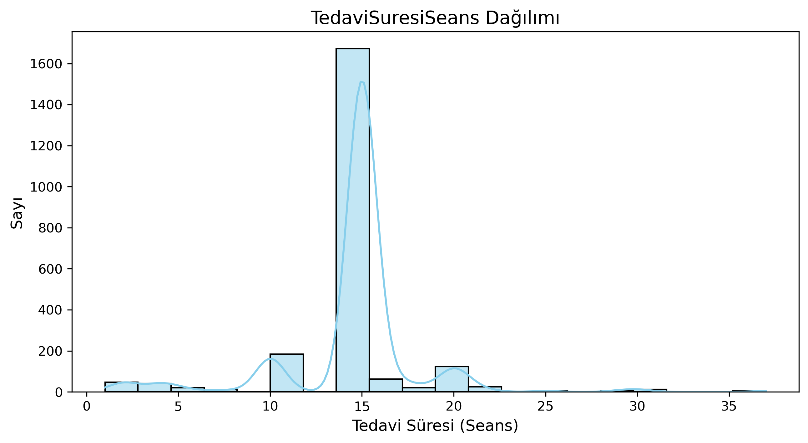
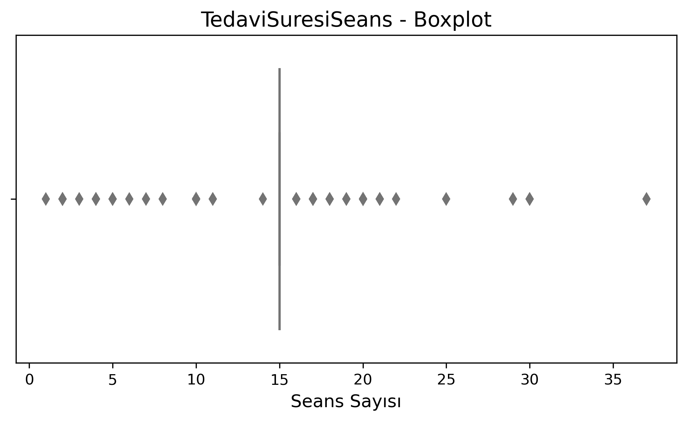
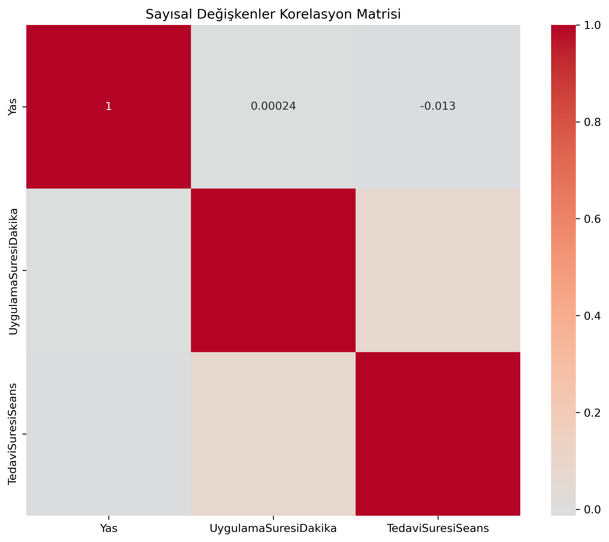

# 🔬 Pusula Veri Bilimi Stajyer Vakası (2025)

<div align="center">

## Fizik Tedavi ve Rehabilitasyon Veri Seti Analizi

**Fatma Zehra TONGA**  
📧 tongafatmazehra@gmail.com

</div>

---

## 🎯 Proje Genel Bakış
Bu repository, fizik tedavi ve rehabilitasyon veri analizi ve ön işleme odaklı **Pusula Veri Bilimi Stajyer Vakası** için kapsamlı bir çözüm içermektedir.

## 🎪 Temel Amaçlar
- 📊 **Keşifsel Veri Analizi (EDA)**
- 🧹 **Veri Temizleme ve Ön İşleme**
- 🚀 **Model-Hazır Veri Seti Hazırlama**
- 🎯 **Hedef Değişken Dönüşümü**  

**Hedef Değişken Dönüşümü Örneği:**  
Orijinal → `TedaviSuresi` (object): `"10 seans"`, `"5 seans"`  
Temizlenmiş → `TedaviSuresiSeans` (integer): `10`, `5`  

---

## 📁 Proje Yapısı

```
PUSULA_FATMA_ZEHRA_TONGA/
│
├── 📂 assets/                       # 🖼️ Grafik ve görseller
│   ├── histogram.png
│   ├── correlation_heatmap.png
│   ├── missing_values.png
│   └── boxplot.png
│
├── 📂 data/
│   ├── raw/Talent_Academy_Case_DT_2025.xlsx
│   └── processed/Talent_Academy_Case_DT_2025_cleaned.xlsx
│
├── 📓 notebook/
│   └── main_eda_analysis.ipynb      # EDA & Ön İşleme
│
├── 📋 README.md                      # Proje Dokümantasyonu
├── 📦 requirements.txt               # Bağımlılıklar
└── 📊 report.pdf                     # Analiz Özeti
```

---

## 📈 Veri Seti Genel Bakış

|                        | Boyut        |
|------------------------|-------------|
| 📊 Orijinal Veri Seti   | (2235, 13)  |
| ✨ Son Veri Seti        | (2235, 61)  |

### 🗂️ Orijinal Sütunlar
| Sütun            | Açıklama                  |
|-----------------|--------------------------|
| HastaNo         | Hasta ID                 |
| Yas             | Yaş                      |
| Cinsiyet        | Cinsiyet                 |
| KanGrubu        | Kan Grubu                |
| Uyruk           | Uyruk                    |
| KronikHastalik  | Kronik Hastalıklar       |
| Bolum           | Bölüm                     |
| Alerji          | Alerjiler                 |
| Tanilar         | Tanılar                   |
| TedaviAdi       | Tedavi Adı               |
| TedaviSuresi    | Tedavi Süresi            |
| UygulamaYerleri | Uygulama Yerleri         |
| UygulamaSuresi  | Uygulama Süresi          |

---

## 🚨 Eksik Değer Analizi

| Özellik          | Eksik Sayı | Yüzde   |
|-----------------|-----------|--------|
| Alerji           | 944       | 42.2%  |
| KanGrubu         | 675       | 30.2%  |
| KronikHastalik   | 611       | 27.3%  |
| UygulamaYerleri  | 221       | 9.9%   |
| Cinsiyet         | 169       | 7.6%   |
| Tanilar          | 75        | 3.4%   |
| Bolum            | 11        | 0.5%   |

---

## 🔧 Veri Ön İşleme Pipeline

1️⃣ **Birincil Anahtar:**  
`HastaNo` → Benzersiz tanımlayıcı olarak bırakıldı  

2️⃣ **Sayısal Özellikler:**  
- `Yas` → Standardize edildi  
- `UygulamaSuresi` → `UygulamaSuresiDakika` olarak sayısal forma dönüştürüldü  

3️⃣ **Kategorik Özellikler:**  
- **Cinsiyet:** Eksik → "Bilinmiyor" | One-hot encoding → `Kadin`, `Erkek`, `Cinsiyet_Bilinmiyor`  
- **Kan Grubu:** Eksik → "Bilinmiyor" | Rh faktörü ayrıldı → `Rh+`, `Rh-`; A, B, AB, 0 ayrı sütunlar  
- **Uyruk:** Basitleştirildi → "Turkiye" & "Uyruk_Diger"  

4️⃣ **Çoklu-Etiket Özellikleri:**  
- **Kronik Hastalıklar:** Eksik → "Bilinmiyor" | Standardizasyon, duplikasyon temizliği, MultiLabelBinarizer, nadir hastalıklar → `Chronic_Other`  
- **Alerjiler:** Eksik → "Bilinmiyor" | Standardizasyon, duplikasyon temizliği, MultiLabelBinarizer, nadir alerjiler → `Allergy_Other`  
- **Tanılar:** Eksik → "Bilinmiyor" | Standardizasyon, duplikasyon temizliği, MultiLabelBinarizer, nadir tanılar gruplandı  
- **Tedavi Adları:** Nadir tedaviler → `Treatment_Other` | One-hot encoding  
- **Uygulama Yerleri:** Eksik → "Bilinmiyor" | MultiLabelBinarizer, nadir lokasyonlar → `Location_Other`  

5️⃣ **Hedef Değişken:**  
- `TedaviSuresi`: "10 seans" → `TedaviSuresiSeans`: 10  

---

## 📊 Keşifsel Veri Analizi (EDA)

### 🔍 Görselleştirme Portföyü

| Grafik Türü   | Amaç                  | Değişkenler                           |
|---------------|----------------------|---------------------------------------|
| 📊 Histogram  | Dağılım analizi       | TedaviSuresiSeans                     |
| 📦 Boxplot    | Aykırı değer tespiti  | TedaviSuresiSeans                     |
| 📊 Bar Plot   | Kategori sayıları     | Cinsiyet, Bolum, TedaviAdi            |
| 🥧 Pie Chart  | Oransal analiz        | KronikHastalik, Alerji vb.            |
| 🔥 Heatmap    | Özellik korelasyonu   | Sayısal özellikler                     |

---

## 📈 Analiz Grafikleri

### 🎯 Hedef Değişken Dağılımı


### 📦 Aykırı Değer Analizi


### 🔥 Korelasyon Analizi


---

## ✅ Son Veri Seti Özellikleri

| Özellik Türü     | Sayı      | Açıklama                         |
|-----------------|-----------|---------------------------------|
| 🔢 Sayısal       | 2         | Yas, UygulamaSuresiDakika      |
| 🏷️ Kategorik     | Çeşitli   | One-hot kodlanmış               |
| 🏷️ Çoklu-etiket  | Çeşitli   | Çoklu-binarize (0/1)            |
| 🎯 Hedef         | 1         | TedaviSuresiSeans               |

**Toplam Özellik:** 61  
**Toplam Örnek:** 2,235  

---

## 🚀 Başlangıç

### 📦 Kurulum
```bash
pip install -r requirements.txt
```

### 🎮 Kullanım
```bash
jupyter notebook notebook/main_eda_analysis.ipynb
```

---

## 🏆 Temel Başarılar
- ✅ Veri kaybı sıfır  
- ✅ Kapsamlı eksik değer yönetimi  
- ✅ Format standardizasyonu  
- ✅ Duplikasyon temizliği  
- ✅ Akıllı özellik mühendisliği  
- ✅ Model-hazır veri seti  
- ✅ Detaylı görselleştirme portföyü  
- ✅ Ölçeklenebilir ön işleme pipeline'ı  

---

<div align="center">

Temizlenmiş veri seti artık tahmine dayalı modelleme veya daha fazla istatistiksel analiz için hazırdır.

</div>

